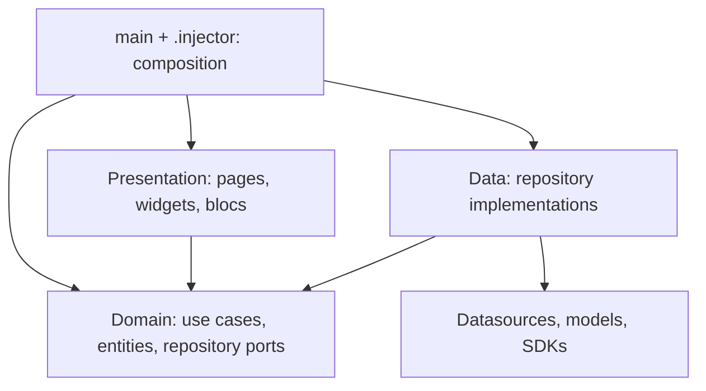

# Working guide

How to make changes in this project. `CLAUDE.md` says which section to read
for which task; read only that section. Ports, use cases, and entities are
listed in `.claude/registry.md`.

## Layers



A page dispatches to a bloc, the bloc calls a use case, the use case calls a
domain port, and the injected data implementation reads or writes storage and
maps models to entities. Compile-time imports point inward only.

Repositories and datasources are grouped by aggregate (`Deck`, `Card`,
`Collection`, `Record`), so a new field touches one model, one mapper, one
local and one remote datasource. Use cases stay one per rule. No feature
folders.

## Where to start

| Change | Start in | Touch other layers only when |
| --- | --- | --- |
| Layout, labels, display state | `presentation/page`, `widget`, `bloc` | Behavior changes |
| Create/update/delete rules | `domain/usecase` | A new repository capability is needed |
| Offline-first sync | `domain/service/sync_policy.dart` | An aggregate needs a new repository method |
| SQL, JSON, Firestore format | `data/datasource`, `model`, `mapper` | Domain meaning changes |
| Catalog paging and cache | `data/repository/card_catalog.dart`, `data/datasource/api` | The caller needs a new catalog capability |
| Auth and user mapping | `data/repository/session.dart` | The UI needs a new session value |
| NFC protocol | `data/repository/nfc.dart`, `data/datasource/device/ndef_codec.dart` | A new `NfcNotice` is needed |
| Wiring, Guest vs online | `lib/.injector`, `lib/.config/runtime.dart` | A constructor or implementation changes |

Example: renaming a deck goes `DeckBuilderBloc` -> `UpdateDeckUsecase` ->
`DeckRepository` -> `DeckRepositoryImpl` -> `DeckLocalDatasource` /
`DeckRemoteDatasource`. A rule that uses existing repository methods does not
touch the data layer.

## Recipes

### Add or change a use case

1. Write `lib/domain/usecase/<name>.dart`; take ports, `Clock`, and
   `IdGenerator` through the constructor (defaults for the last two).
2. Export it from `lib/domain/usecase/index.dart`.
3. Register it in `lib/.injector/register_usecase.dart`.
4. Add or update its entry in `.claude/registry.md`.
5. Test it with in-memory ports (`test/support/test_app.dart` fakes).

### Add a field to an entity

Entity (`domain/entity`, `copyWith`, `props`) -> model (`data/model`,
local and remote JSON) -> mapper (`data/mapper`) -> SQL schema if stored
locally (see [Change the SQLite schema](#change-the-sqlite-schema)) -> remote
datasource if the field is sent to Firestore. Update the registry if the
entity's description changes.

### Add a port method

Declare it in `lib/domain/repository/<aggregate>.dart`, implement it in
`lib/data/repository/<aggregate>.dart` and the datasource, add the member to
`.claude/registry.md`, and add it to any fakes in `test/` that implement the
port (`dart analyze` lists them).

### Add a bloc or page

- The bloc takes use cases only. It imports nothing from Flutter except
  `flutter_bloc`. Events carry already-translated strings.
- Every awaited use case runs inside `guard(emit, ErrorKeys.x, body)` from
  `ErrorReporting`; the error becomes `state.errorMessage` (a translation
  key), and the page shows it with `ErrorListener`.
- Register it in `lib/.injector/register_bloc.dart`. A page-scoped bloc gets a
  factory in `PresentationDependencies` (`lib/presentation/dependencies.dart`,
  wired in `lib/.injector/presentation_dependencies.dart`) and is closed by
  its `BlocProvider`. A shared bloc uses `BlocProvider.value`.
- Coordinate blocs in a `BlocListener`, never by a widget that dispatches to
  several blocs and reads their state in between.
- Side effects (clipboard, navigation, snackbars) run in widgets or listeners
  reacting to state.

Shared state has one owner: `ApplicationBloc` owns the signed-in user and the
online flag, `DeckBloc` owns the deck list, `DeckBuilderBloc` owns the deck
being built across builder, collection, browse, and card routes, and
`TrackerBloc` plus `ReaderBloc` run the tracker page.

### Add a translation

Add the key to all three files in `assets/locale/` (`en`, `ja`, `th`).
Domain never holds translation keys: it returns enums (`CardLookupFailure`,
`TrackingOutcome`, `NfcNotice`) and the bloc or page maps them to keys.

### Add a supported game

1. Implement `GameApi` in `lib/data/datasource/api/<game>.dart` with a
   `(ApiClient client, String baseUrl)` constructor (`scryfall.dart` is the
   reference):
   - `fetch(cursor)` returns `CardPage(cards, next)`; an empty cursor is the
     first page and `next: null` marks the last page.
   - `find(cardId)` returns `null` when the API answers 4xx.
   - Every request goes through `ApiClient.getJson`; pass `minInterval` if
     the API asks for request spacing. Never create an `http.Client`.
2. Add the constructor to `GameApiRegistry.builtIn` under a `GameConfig`
   id constant.
3. Add the base URL to `GameConfig._environments` for each environment that
   should offer the game, and `assets/image/game/<id>.png`.
4. Test the adapter with `MockClient` (see `test/game_api_test.dart`).

### Change the SQLite schema

`DatabaseConstant.tables` is always the latest schema and runs only on a
fresh install. To change it:

1. Edit the `CREATE TABLE` statement in `tables`.
2. Bump `dbVersion` to `n` and add `migrations[n]` with the statements that
   bring a version `n - 1` file to the same schema.
3. Add a case to `test/database_migration_test.dart` if the migration moves
   data, not just columns.

`DatabaseService._migrate` runs `migrations[old + 1]` through
`migrations[new]` in order inside the upgrade transaction, so a failure
rolls back and the file stays at its old version. Never edit a migration
that has shipped.

### Change sync behavior

`SyncPolicy.write` saves locally and marks `isSynced` from the remote result.
`SyncPolicy.delete` records a pending delete when the remote call fails,
and `SyncPolicy.reconcile` retries those instead of importing them. It
imports remote-only rows, keeps the newer side by
`updatedAt`, pushes unsynced rows, and deletes local rows that are synced but
absent remotely. `SyncPendingUsecase` pushes only unsynced rows and
pending deletes; `ApplicationBloc` runs it on sign-in and when the device
comes back online. Any change there affects every aggregate, so test it in
`test/domain_workflows_test.dart` and against SQLite.

## Rules

Enforced by `tool/rules.dart` and `test/architecture_test.dart` (the test is
the rule of record; change both together):

- Domain imports only domain plus `equatable` and `uuid`.
- Presentation never imports data, `.injector`, `main.dart`,
  `domain/repository`, or infrastructure SDKs.
- Data never imports presentation or composition. No import cycles.

Conventions:

- NFC exposes `NfcResult` and `TagEntity`, never `NfcTag` or `Ndef`. Auth
  exposes `SessionUser`, never Firebase `User`.
- Settings are the typed `AppSettings`; storage keys live in
  `.config/app.dart` and only `SettingsLocalDatasource` reads them.
- Entity ids, names, card lists, and `isSynced` are non-null with empty
  defaults. Optional card fields are cleared with `copyWith(clearX: true)`.
- `userId` is empty in Guest mode, and use cases skip remote calls then.
  The guest id is never used as a `userId`.

## Data rules

- Conflicts are last-write-wins per row: `reconcile` keeps whichever side
  has the later `updatedAt`, taken from each device's clock. If two devices
  edit the same row before syncing, the older edit is lost, and a device
  with a wrong clock can win or lose unfairly. This is a deliberate choice
  for a single-user app; there is no merge or conflict copy.
- Built-in game collections (`GameConfig.availableGames`) are catalog cache,
  not user data. `CollectionRepository.fetchForLocal` excludes them, so sync
  never uploads or deletes them, and clearing user data keeps them.
- `cards`, `cardsInDeck`, and `pages` reference their parent with
  `ON DELETE CASCADE`. Never `INSERT OR REPLACE` a parent row: it deletes and
  cascades. `SQLiteService.insert` aborts on conflict by default; use
  `upsertBatch` to refresh existing rows.
- Multi-row local writes run inside `SQLiteService.transaction`. Local
  failures throw and blocs turn them into `errorMessage`.
- Remote reads throw `RemoteUnavailableException` when Firestore is offline,
  unconfigured, or returns a malformed document, so `reconcile` keeps local
  data. Remote writes return `false`, which `SyncPolicy` records as unsynced.
- Game APIs share one `ApiClient`: one connection pool, a User-Agent,
  per-host request spacing, up to two retries on 429/5xx or network errors
  (honoring `Retry-After`), one request for concurrent identical GETs, and a
  10-minute memory of 404s. Persistent failures surface as
  `RemoteUnavailableException`.
- The catalog stores the API's paging cursor per collection and loads the
  next `ApiConfig.catalogBatchSize` pages on each browse until `next` is
  null. A failed page stops the batch without advancing the cursor.
- A card found through the API during a tag scan is saved locally, so later
  scans of that card never call the API.
- Local image files are deleted by `ImageRepositoryImpl` once replaced,
  uploaded, or cleared.
- NFC reads accept read-only tags; writes check `isWritable` and the tag's
  `maxSize`. The `coId:` / `caId:` text record format must not change: tags
  already written in the field depend on it.

## Testing

```powershell
dart run tool/verify.dart   # graph --check, registry, dart analyze
. .\scripts\android-env.ps1
flutter test --no-pub --dart-define=GUEST_MODE=true
flutter build apk --debug --target-platform android-x64 --dart-define=GUEST_MODE=true --no-pub
# emulator running (scripts/run-guest.ps1 starts one):
flutter test integration_test/guest_app_test.dart -d emulator-5554 --dart-define=GUEST_MODE=true --no-pub
# screenshots of every page with mock data, written to .temp/screenshots
# (wipes the emulator's guest data first):
flutter drive --driver=test_driver/screenshots.dart --target=integration_test/screenshots_test.dart -d emulator-5554 --dart-define=GUEST_MODE=true --no-pub
# online build (needs android/app/google-services.json and a filled .env):
flutter drive --driver=test_driver/screenshots.dart --target=integration_test/online_smoke_test.dart -d emulator-5554 --no-pub
```

| What changed | Test with |
| --- | --- |
| Use case | In-memory port fakes; `test/domain_workflows_test.dart` for patterns |
| Datasource, SQL, repository | `openTestDatabase()` from `test/support/sqlite.dart` (real in-memory SQLite, cascades as on a device) |
| Bloc | Real use cases over fakes; see `test/tracker_bloc_test.dart` |
| Page flow | `TestWorld` in `test/support/test_app.dart`; see `test/flows_widget_test.dart` |
| Game API | `MockClient` from `package:http/testing.dart`; see `test/game_api_test.dart` |
| NDEF codec | `NfcTag` built from a data map; see `test/nfc_flow_test.dart` |

`test/README.md` lists every test file. `integration_test/` runs the real
Guest app (composition, SQLite, SharedPreferences) on an emulator; it seeds
a card through use cases because the image picker cannot be scripted. No
test covers physical NFC, real Firebase, or real Supabase.

`dart run tool/graph.dart` regenerates `.obsidian-graph/` (one note per file,
`.VIOLATIONS.md`, `.GRAPH-CONTEXT.md`); open it as an Obsidian vault to see
the dependency graph.
