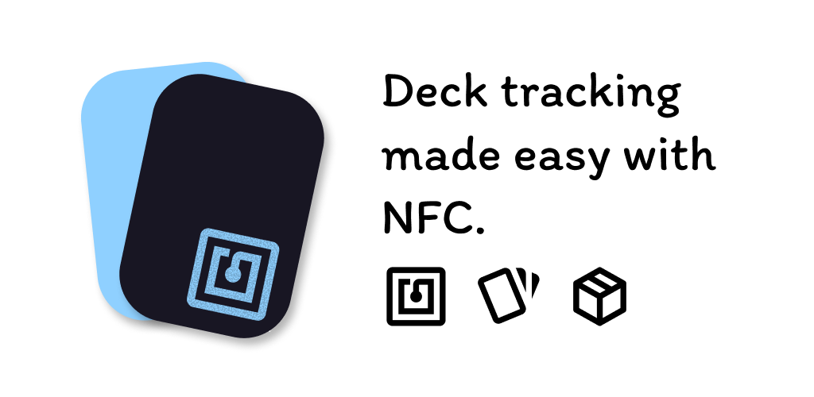

# NFC Deck Tracker

A Flutter app for building trading card game (TCG) decks and tracking them
during play with NFC tags. Bachelor's thesis, Silpakorn University.



## Features

- Deck building across multiple games
- Card search through public game APIs or custom collections
- Custom cards with images
- Real-time deck tracking by scanning NFC tags
- Match history and deck usage statistics
- English, Japanese, and Thai

## Getting started

Requirements: Flutter 3.41.1, JDK 21, Android SDK 36.

### Guest mode

Runs fully offline with local storage. No Firebase, Supabase, or `.env`
values needed. Google sign-in, remote card catalogs, cloud sync, and record
sharing are unavailable.

On this Windows workspace the Android SDK, JDK, and emulator live in the
ignored `.local/` directory:

```powershell
powershell -ExecutionPolicy Bypass -File .\scripts\run-guest.ps1
```

`-BuildOnly` builds an x86_64 debug APK; `-DeviceId <id>` runs on a connected
device. Manual commands:

```powershell
. .\scripts\android-env.ps1
flutter run --dart-define=GUEST_MODE=true
```

NFC scanning requires a physical device.

### Online mode

1. Copy `.env.example` to `.env` and set `SUPABASE_URL` and
   `SUPABASE_ANON_KEY`. Use the anon key only; `.env` is bundled into the app.
2. Add `android/app/google-services.json` or
   `ios/Runner/GoogleService-Info.plist`.
3. Run `flutter run`.

Release builds also need `android/key.properties` and a keystore.

## Development

```powershell
dart run tool/verify.dart
flutter test --dart-define=GUEST_MODE=true
flutter test integration_test/guest_app_test.dart -d emulator-5554 --dart-define=GUEST_MODE=true
```

`verify.dart` checks layer boundaries, `.claude/registry.md`, and
`dart analyze`. Working guide: [.claude/guide.md](.claude/guide.md).
Source overview: [lib/README.md](lib/README.md).

## Project

| | |
| --- | --- |
| Student | Vijuksama Hongthongdaeng (640710759) |
| Advisor | Lecturer Apisake Hongwitayakorn |
| Academic year | 2024 |
| Department | Information Technology, Faculty of Science, Silpakorn University |

Thesis document and design materials: `documents/`.

## License

[MIT](LICENSE)
