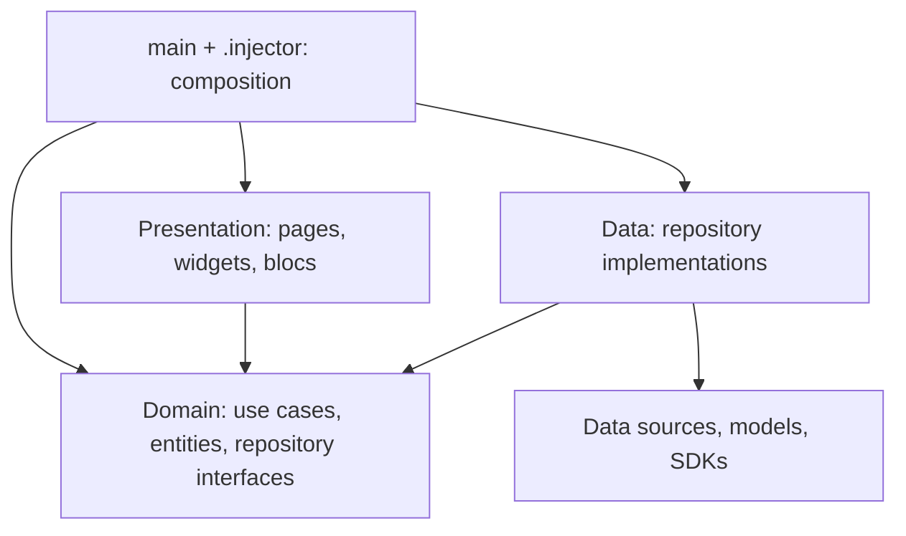

# Layer boundaries



At runtime a view calls a bloc/use case, the use case calls a domain repository
interface, and the injected data implementation accesses storage. Data maps
models to entities before returning. Compile-time dependencies point inward,
even though runtime calls eventually reach the data layer.

## Where to change code

| Change | Starting point | Change other layers only when |
| --- | --- | --- |
| Layout, labels, display state | `presentation/page`, `widget`, `bloc` | Application behavior changes |
| Create/update/delete/sync rules | `domain/usecase` | A new repository capability is required |
| SQL, JSON, remote storage format | `data/datasource`, `model`, `mapper` | Domain meaning changes |
| Repository implementation | `data/repository` | The domain contract needs a new operation |
| API pagination/cache | `data/repository/card_catalog.dart`, `data/datasource/api` | The caller needs a new catalog capability |
| Auth provider/user mapping | `data/repository/session.dart` | The UI needs a new domain session value |
| NFC protocol/plugin | `data/repository/nfc.dart`, `data/datasource/device/ndef_codec.dart` | A new result type is needed |
| Wiring/Guest implementation | `.injector` | A constructor or implementation changes |

For example, renaming a deck follows `DeckBloc` → `UpdateDeckUsecase` →
`DeckRepository` → `DeckRepositoryImpl` → local/remote data sources.
Changing a database field should not require importing `DeckModel` into the
bloc or use case. A rule using existing repository methods should not require
editing the data layer.

Repositories are grouped by responsibility rather than individual CRUD action.
Existing use case entry points and datasource operations remain. This refactor
does not reorganize the project into feature folders.

## Boundaries and ownership

- Domain has no Flutter, SDK, app configuration, data model, mapper, or GetIt
  imports. Pure Dart `equatable` and `uuid` remain permitted.
- Presentation calls use cases and works with entities. It does not import
  repository ports/implementations, storage clients, or infrastructure SDKs.
- Data implements domain ports, owns serialization and platform I/O, and never
  imports presentation or composition.
- `main.dart` initializes the app. `.injector` selects implementations and
  constructs dependencies. `presentation/app.dart` receives them explicitly.
- `PresentationScope` provides typed factories and shared state to pages.
  It cannot resolve arbitrary repositories or SDKs. Constructor injection stays
  in blocs/use cases; GetIt stays in composition.
- Factory-created blocs are owned/closed by their page or `BlocProvider`.
  Shared blocs use `BlocProvider.value`.
- UI rendering adapters remain in presentation: QR camera view, images, charts,
  localization assets, navigation, and clipboard display actions. Selecting and
  copying images into storage runs through `DeviceUsecase` and its data adapter.
- NFC callbacks expose `NfcResult` / `TagEntity`, never `NfcTag` or `Ndef`.
  Presentation chooses translation keys for typed notices.
- Auth exposes `SessionUser`, never Firebase `User`. Guest binds to
  `GuestSessionRepository` and offline cloud services without Firebase setup.
- Settings default exclusions and diagnostic logging are injected into domain.

## Tooling

```powershell
dart run tool/graph.dart            # .obsidian-graph/ notes, .VIOLATIONS.md, .GRAPH-CONTEXT.md
dart run tool/verify_registry.dart  # .claude/registry.md against ports, use cases, entities
dart run tool/verify.dart           # graph --check, registry, dart analyze
```

Open `.obsidian-graph/` as an Obsidian vault. Warm colors mark violations,
cool colors mark ports, use cases, blocs, pages, and composition. Rules live in
`tool/rules.dart` and mirror `test/architecture_test.dart`; change both
together.

## Verification

```powershell
. .\scripts\android-env.ps1
flutter analyze --no-pub
flutter test --no-pub --dart-define=GUEST_MODE=true
flutter build apk --debug --target-platform android-x64 --dart-define=GUEST_MODE=true --no-pub
```

`test/architecture_test.dart` enforces import direction, including relative paths,
exports, parts, and indirect project dependencies. Other tests cover domain
workflows with in-memory ports, repository/entity/SQL mapping, typed NFC events,
the existing NDEF format, and Guest composition without cloud credentials.
Emulator smoke testing checks startup/navigation. Physical NFC and real online
services still require hardware/configuration; these tests do not prove them.

## Behavior intentionally deferred

The following review findings need separate behavior changes:

- Sync uses a remote snapshot taken before local uploads; deletion decisions
  can use stale data. Remote read failures now raise
  `RemoteUnavailableException` and skip the sync instead of deleting local rows.
- Account transitions in Settings and Landing have existing sign-in/sign-out
  inconsistencies. Settings clears local data without checking sign-in success.
- Nullable `copyWith` fields cannot always be explicitly cleared.
- Local deck updates update card membership rather than all deck metadata.
  Multi-row local writes (`create_deck`, `update_deck`, `clear_user_data`) run
  inside `SQLiteService.transaction`, where a failed write rolls back the rest.
- NFC validation, capacity assumptions, and restart behavior retain existing rules.

These are existing findings, not behavior introduced or fixed by this refactor.
